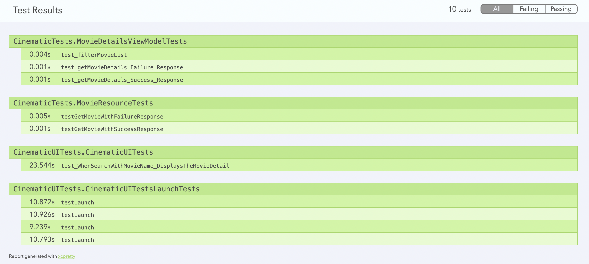

# Cinematic 

This is a project which simlply fetches the top 250 IMDB movies using 
https://imdb-api.com/en/API/Top250Movies/k_23j0vno9 and show in Tableview.
User can search movies as well. This projet uses MVVM pattern and SOLID prinicipls to decouple the
funcationality.

## Tools Used

* Xcode version 13.3
* iOS Simulator

## Technology Used

* UIKit
* MVVM
* Swift 5

## Pods Reference

Used `SDWebImage` for fetching the images from URL. This can be achive uisng URLSession.shared.dataTask and NSCache as well.

To install same open terminal and go to project directory and follow below commands

1) Open the terminal

2) Command on the terminal: 
    ```
    sudo gem install cocoapods
    ```

3) Set your project path in the terminal.
    cd ProjectPath

4) Enter Command: 
    ```
    pod init
    ```

5) Step 4 will generate .pod file at your porject directory level
   Go to the pod file of your project and add the pod 
     '# Pods for Cinematic'
	  pod 'SDWebImage'

6) Enter Command: 
    ```
    Pod install
    ```

7) Close Xcode project and open your project from the terminal Command: 
        ```
            open Cinematic.xcworkspace
        ```

  Or goto project folder and can open Cinematic.xcworkspace file in XCode


## Test Results From Bitrise

Fore details, please check in the `Test.assets` folder

## <u>Test Case Result</u>


